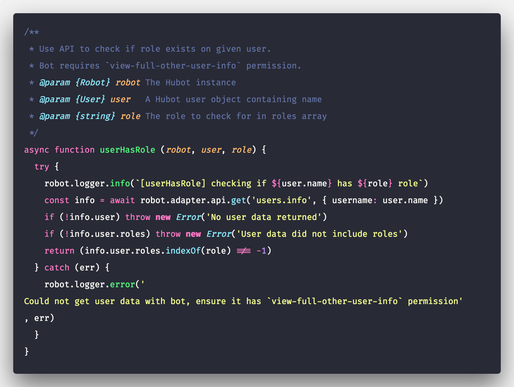
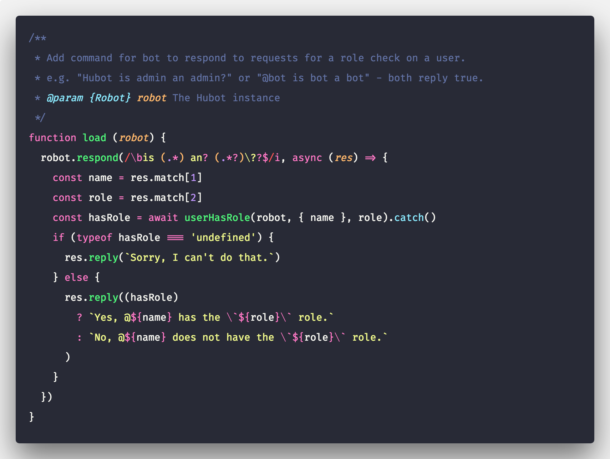
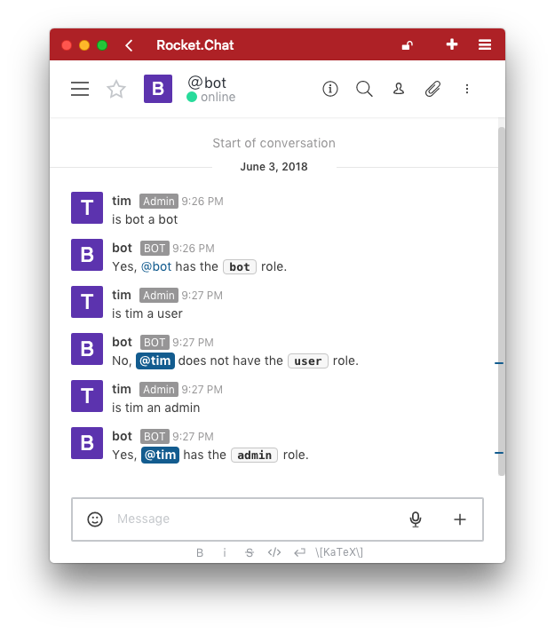

# Hubot Rocket.Chat Snippets

Included in the adapter source are some snippets for advanced usage of Hubot and
the Rocket.Chat JS SDK (included in the adapter). They can be tested locally by
developers, but aren't included in the package published to NPM.

The snippets documented here aren't intended for use in every instance and the
method of loading them is not recommended other than for testing these examples.
Please see https://rocket.chat/docs/bots for more general getting started tips.

## Available Snippets

- [Use API to check if role exists on given user](snippets/userHasRole.js)
- [Use API to clear the room history](snippets/cleanRoomHistory.js)
- [Use API to add users to Hubot's brain](snippets/syncBrainUsers.js)

e.g. To execute one of the demos, from the adapter root in local CLI with Node:

```
node docs/snippets userHasRole
```

Then login to talk to the bot in your local Rocket.Chat instance. For this
example, try "bot is admin an admin".

See [index.js](snippets/index.js) to learn how a mock Hubot loads the snippets.

## Testing Environment

Running the example snippets locally requires the same environment settings
as any bot, but it's recommended to only use them on a test instance, with
test users and rooms, similar to the approach used for testing the SDK:

https://github.com/RocketChat/Rocket.Chat.js.SDK#installing-rocketchat

## Snippet Patterns

Each snippet demonstrates a specific function, which is exported for tests,
they also may include a `load` function that add commands to demonstrate the
snippet in use. The exports don't follow the normal Hubot script pattern,
which is to export a single function accepting the bot as a single argument.

Note, many command helpers follow the pattern of returning undefined if not
successful, as opposed to throwing. This allows them to log errors and let
the bot send an apology rather than silently failing.

## Example Snippet

### `userHasRole`

#### Define Function

This example demonstrates the pattern. The function is defined outside the scope
where the bot is available, so it takes the `robot` instance as first parameter.
Then Hubot scripts would use it within the `module.exports = (robot) =>` block.

Keeping async calls within a `try`...`catch` block allows any errors or promise
rejections to go to a single handler, which logs the error, returning undefined.



#### Load Command

The load  function adds a listener callback, providing `userHasRole` utility to
users. The RegExp pattern matching uses word boundaries `\b`, capture groups,
`(.*)` and optional characters `an?` and `\??` with start `^` or end of line
matching `$` to make sure it doesn't accidentally match on other messages.
It takes inputs from matching capture groups as arguments for `userHasRole`.



In production, it would be recommended to check that the user making the request
has permission to lookup other user's roles. This could be done like:

```js
robot.respond(PATTERN, async (res) => {
  const allowed = await userHasRole(robot, res.message.user, 'admin').catch()
  if (!allowed) return res.reply(`Sorry, you can't do that.`)
  ...
})
```

### The Result



Enjoy.

___

[polacode]: https://github.com/octref/polacode
[firacode]: https://github.com/tonsky/FiraCode
> Image created by [Polacode][polacode] with [Fira Code font][firacode]
